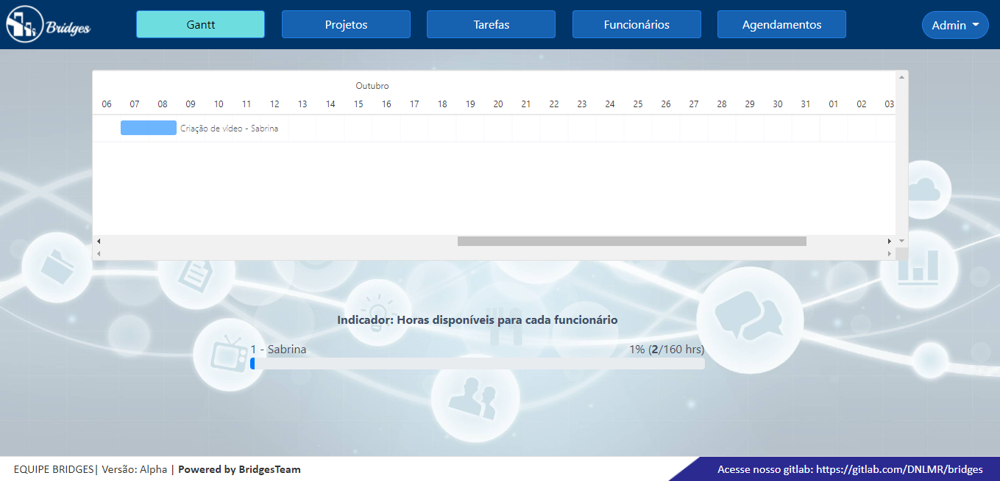

#### Sabrina Rafaela Calado Mariano

# Sobre mim

Cursei junto com o ensino médio o técnico de administração de empresas e 2013 comecei a trabalhar na área e comecei a fazer dois cursos superiores em outras áreas, mas ainda não sentia que eu me encaixava no curso ou no emprego. Em 2018 surgiu a vontade e oportunidade de começar um curso técnico no Senac na área de informática, eu já tinha tido contato antes mas nunca pensei em trabalhar com isso. A convite de um amigo que fazia Banco de Dados na Fatec, comecei a participar de eventos de programação e apesar de não entender muito, fui anotando o que achava relevante para consultar posteriormente conforme aprendia. No segundo semestre de 2019 já estava terminando o curso de informática no Senac, ao mesmo tempo comecei a trabalhar como suporte técnico para uma empresa que produz software próprio e comecei a fazer o curso de Banco de Dados na Fatec. Em 2021 recebi a proposta dessa mesma empresa de trabalhar como Front-end em um de seus aplicativos e permaneço até então.

# Meus Projetos

#### Em 2019-2
O primeiro projeto de foi proposto em parceria com a própria [Fatec](https://fatecsjc-prd.azurewebsites.net/) onde deveriamos solucionar um problema de nossa escolha com a criação de um webbot. 
Nosso bot foi criado pensando em pessoas que pensam em investir em ações da bolsa de valores porém tem pouco conhecimento, não sabe por onde começar ou tem pouco tempo para procurar e analisar a melhor oportunidade. O bot chamado BlackMamba possui funções para raspagem de dados de ações escolhidas pelo usuário diretamente da bolsa de valores e que poderão receber por email, Telegram ou consultar online estatisticas dessa ação, bem como, histórico dos útlimos 12 meses para ajudar o usuário a acompanhar e decidir se aquele investimento será benéfico ou não. 
**[GIT para projeto](https://github.com/SabrinaRCM/webbot-blackmamba-1-semestre)**

#### Tecnologias Utilizadas
* Python 3.7 - Linguagem principal;
* Django, Javascript, HTML5, CSS,  Bootstrap - Front End WEB;
* MySQL - Banco de Dados;
* PowerBI - Usado posteriormente para exibição dos dashboards. 
* Principais Bibliotecas Python:  
    **PyMySQL** - interação com nosso Banco de Dados;  
    **Selenium** - navegação pela Web através do WebDriver do Google Chrome;  
    **Beautiful Soup** - interação com o html dos sites para permitir as raspagens de dados;  
    **Pandas / Matplotlib** - ferramentas para gerar e plotar graficos;  
    **Email / Telegram-bot** - envio de alertas e notificações;
    
## Contribuições Pessoais
Nesse projeto atuei na construção das telas de front end para o usuário e na manipulação da biblioteca **Pandas** para geração dos gráficos e **Matplotlib** para de gráficos a serem enviados por Email e Telegram-bot. 
Criei o wireframe e comecei a desenvolver utilizando HTML, CSS, JavaScript combinado com Bootstrap para o visual do site. Foi criada a tela de login, dashboard e cadastro de novo usuário. Posteriormente decidimos substituir essa interface pelo PowerBI pois decidimos mostrar apenas o Dashboard, onde auxiliei na criação do mesmo.  
Também fui responsável pela manipulação das bibliotecas que iriam receber os dados da raspagem, realizar leitura, e plotagem.

#### Hard Skills Efetivamente Desenvolvidas
* Python: Aprendi como criar e executar um projeto com autonomia.
* Django: Aprendi a usar com ajuda.
* PowerBI: Aprendi a usar com ajuda.
* Pandas / Matplotlib: Aprendi a usar com autonomia.
* Metodologias Scrum: Aprendi na prática.

#### Soft Skills Efetivamente Desenvolvidas
* Integração com equipe: Eu estava na lista de espera da Fatec, e quando me chamaram para começar, as aulas já estavam com 3 semanas, então tive que entrar em um grupo formado. Todos já estavam integrados e eu tive um pouco mais de trabalho para me encaixar na equipe e no projeto no início. 
* Confiança: Nós estavámos sendo orientados por um Product Owner e um Scrum Master do 6° semestre, foi preciso confiar na experiência que eles possuiam para nos orientar.
* Organizar projetos: Aprendi na prática como distribuir tarefas em um projeto através de boards com atividades.

#### Em 2020-1
O segundo projeto teve como Parceiro Acadêmico a empresa [Necto](http://www.nectosystems.com.br/pt/). Nossa proposta foi criar um gerenciador de projetos web. 
A aplicação web **Bridges**(Do inglês, ponte) foi criada pensando em ser como uma ponte para gerenciamento eficaz de projetos. A aplicação permite ao usuário se logar, inserir um projeto, uma tarefa, funcionários, atribuir funcionários a tarefas em tela própria para cada um e gerenciar o tempo disponível de cada funcionário em cada tarefa em uma única tela composta do gráfico Gantt e gráfico indicador.  

**[GIT para projeto](https://github.com/SabrinaRCM/bridges-2-semestre)**

#### Tecnologias Utilizadas
* Python 3.7 - Linguagem principal
* FrameWork Django 3 - interface WEB
* MySQL - Banco de Dados
* Frappe Gantt - interface do gráfico gantt
* Principais Bibliotecas Python:  
     **PyMySQL** - interação com nosso Banco de Dados; 
     **Crispy Forms** - renderizar formulários com Bootstrap; 
     **Import-export** - para importar e exportar arquivos de excel .csv;

## Contribuições Pessoais
Do mesmo modo, a preocupação com a TI verde pode nos levar a considerar a reestruturação da garantia da disponibilidade. Evidentemente, a interoperabilidade de hardware causa impacto indireto no tempo médio de acesso dos procolos comumente utilizados em redes legadas. Enfatiza-se que o aumento significativo da velocidade dos links de Internet conduz a um melhor balancemanto de carga da gestão de risco.

#### Hard Skills Efetivamente Desenvolvidas
Java, SQL, JavaScript

#### Soft Skills Efetivamente Desenvolvidas
Proatividade 
Ainda assim, existem dúvidas a respeito de como a alta necessidade de integridade representa uma abertura para a melhoria dos equipamentos pré-especificados.

#### Em 2020-2
Trabalhei no projeto da API com o Parceiro Acadêmico Wild Apricot. 
O incentivo ao avanço tecnológico, assim como a preocupação com a TI verde acarreta um processo de reformulação e modernização da garantia da disponibilidade. Evidentemente, a revolução que trouxe o software livre causa impacto indireto no tempo médio de acesso do tempo de down-time que deve ser mínimo. Enfatiza-se que a consolidação das infraestruturas conduz a um melhor balancemanto de carga da gestão de risco. Nunca é demais lembrar o impacto destas possíveis vulnerabilidades, uma vez que o desenvolvimento contínuo de distintas formas de codificação implica na melhor utilização dos links de dados das ferramentas OpenSource. 
[link para o GIT](https://www.google.com)

#### Tecnologias Utilizadas
RPA, Machine Learning, Reconhecimento de Voz e ChatBot

## Contribuições Pessoais
Do mesmo modo, a preocupação com a TI verde pode nos levar a considerar a reestruturação da garantia da disponibilidade. Evidentemente, a interoperabilidade de hardware causa impacto indireto no tempo médio de acesso dos procolos comumente utilizados em redes legadas. Enfatiza-se que o aumento significativo da velocidade dos links de Internet conduz a um melhor balancemanto de carga da gestão de risco.

#### Hard Skills Efetivamente Desenvolvidas
Java, SQL, JavaScript

#### Soft Skills Efetivamente Desenvolvidas
Proatividade 
Ainda assim, existem dúvidas a respeito de como a alta necessidade de integridade representa uma abertura para a melhoria dos equipamentos pré-especificados.

## Meus Principais Conhecimentos
Edge AI
AI Engineering
IOB
Hiperautomação
Segurança Modular
Nuvem Distribuída

## Contatos
* [GIT](https://www.git.com)
* [LinkedIn](https://www.linkedin.com)

